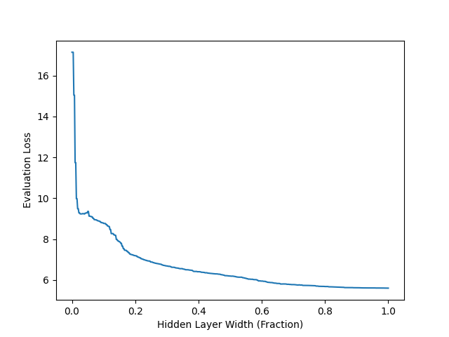

# Variable-Sized Neural Networks

This codebase implements Triangular Dropout (https://arxiv.org/abs/2205.01235) and a variety of utilities for creating variable-width models. For hidden layers of width W, masks of the form [1, 1, ..., 1, |0, ..., 0, 0 ] are generated with a random dividing point 1<=w<=W. By randomly applying these masks during training, the model learns weights that approximate subnetworks with all widths w. As w is increased, the model's performance approaches that of the full-capacity model.

After training, the model can be ablated in width to recover a smaller dense model with lesser performance. Typically the relationship between width and performance asymptotes as width increases:



This figure is generated from the example in ```examples/mlp/match_static_network.py```.

Note that the asymptotic performance is often slightly less than the full model trained without this technique, due to the additional constraints the triangular dropout imposes on the optimization. This can be overcome with additional training, larger models, or fine-tuning of the recovered submodels. See *Known Limitations* below. 


## Installation

The only major dependencies of this codebase are pytorch and numpy. Once these are installed, simple clone this repo and:

```
pip install -e .
```


## Use Cases

There are a variety of interesting use cases for this mechanism. Most obviously, it can be used to train a large network and then select an ideal size/performance trade-off after the fact. Additionally, we have found the following uses:

- In autoencoders, Triangular Dropout can be used to create learned features that successively build on each other, such that increased reconstruction fidelity is obtained by retaining more width at the inner encoding. See figure 3 in the paper.
- In reinforcement learning, Triangular Dropout can be used to create a variable-sized policy. For some tasks like the control problems from Mujoco, extremely small policies are sufficient to solve the task, and these can be recovered as subnetworks after training.
- In language models, Triangualr Dropout can allow for all training resources to be dedicated to created a single model, while end users can select a smaller submodel that is consistent with their own inference/fine-tuning resources. These results are in progress.


## Known Limitations

It is known that a model trained with triangular dropout does not match to performance of an unconstrained model, although the two can be very close. 

Future work may look at interpolating between the triangular dropout setting and the unconstrained network, such that practitioners can find a nice balance between these two.


## Consistent Masking Across Layers

Note: See the comments at the top of ```vsnn/masks.py``` for more details.

#### Layers of Identical Width

To simulate a network of a specific width for a single sample, masks must be consistent across multiple layers. That is, for an MLP with hidden width W, and a mask M of the form [1, ..., 1| 0, ... 0] such that the number of ones is less than or equal to W, M should be identical for all hidden layers.

If masks are randomly created, this is accomplished by using an identical random seed for each layer. Thus the same random mask is created at each later. The seed is automatically changed after the backward pass, such that the set of generated masks will be different on the following training pass.

Note that the object that creates masks is a singleton which is shared by all layers. By changing settings of this object (i.e. the current seed) it applies to all created masks.

#### Layers of Mismatched Width

The above method does not work when trying to mask multiple layers of different widths, and in general, mismatched widths present a problem for this technique.

Imagine two hidden layers, one of width 6 and one of width 9. If we generate a mask of the form [1, 1, 1, 1, 1, 0] for the first layer, there is no corresponding mask for the second layer (we cannot evenly mask 5/6ths of 9 neurons- this would require masking 7.5 neurons).

To overcome this issue, you can set the mask-maker's "base" to the greatest common divisor of all layer widths. This creates masks of a smaller width and then repeats their elements up to the desired size of the actual layers. 

For the above example, we could use: ```masker.base = 3```.

This would generate masks like [1,0,0], [1,1,0], and [1,1,1]. These are made applicable to both layers by repeating elements. For the first mask ([1,0,0]), the layer of width 6 would see: [1,1,0,0,0,0] and the layer of width 9 would see: [1,1,1,0,0,0,0,0,0]. If we wish to ablate this network later on (select a thinner subnetwork), we can select sizes that are multiples of 3.


## License

This work is authored by Ted Staley and is Copyright © 2024 The Johns Hopkins University Applied Physics Laboratory LLC, please see the LICENSE file.